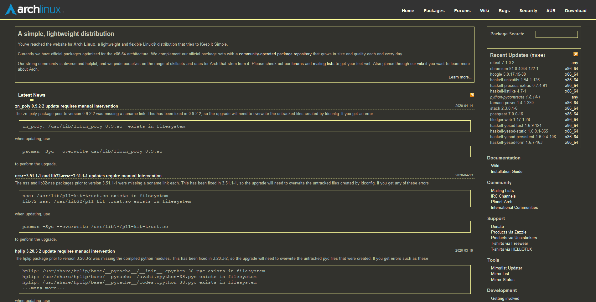
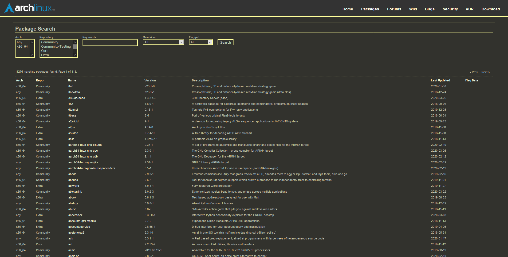
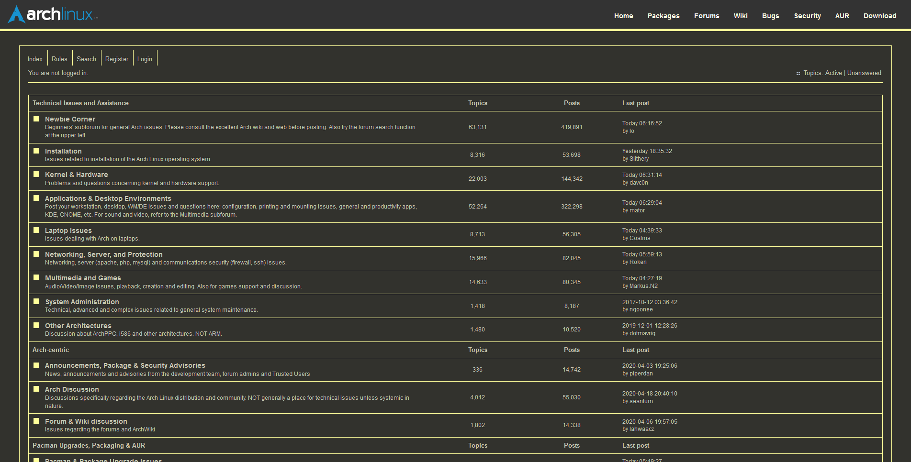
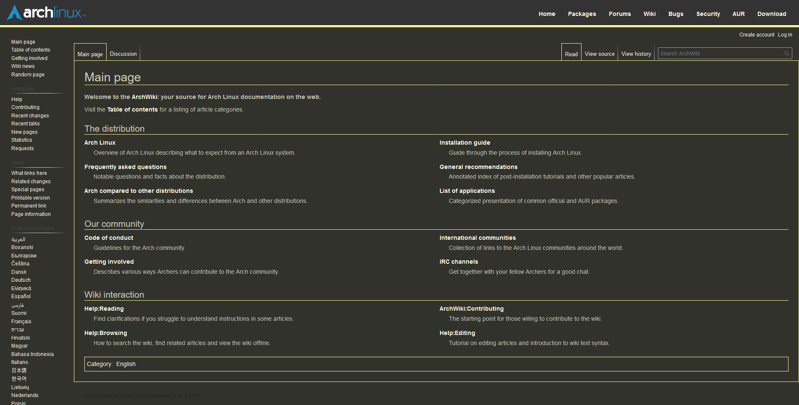
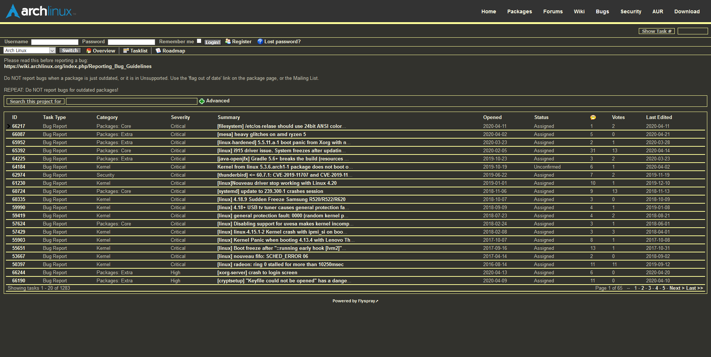
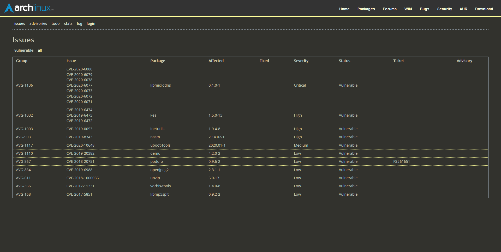
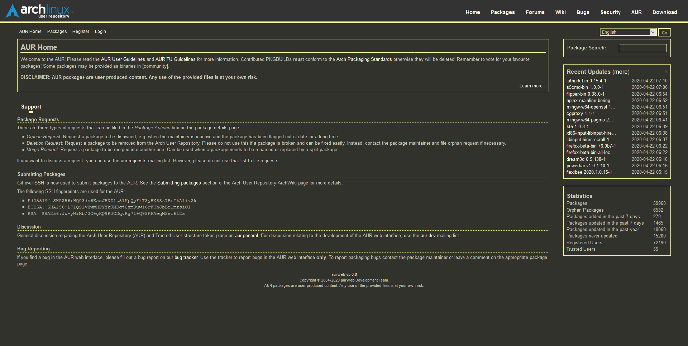
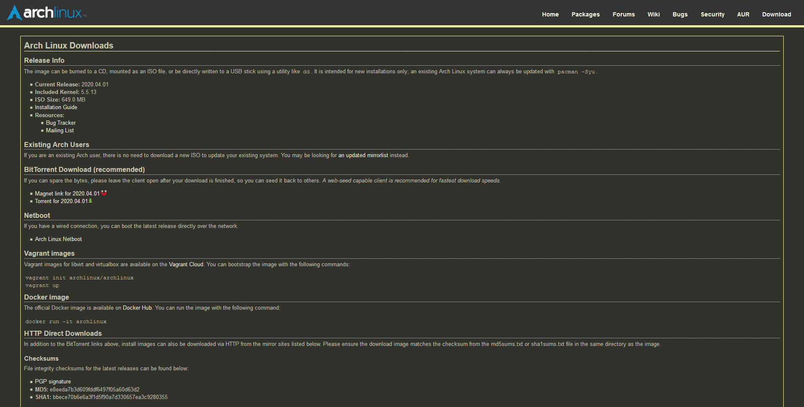

# Arch Linux Yellow Dark

Styles the archlinux.org website for the Arch Linux distribution with a dark yellow color scheme.

## Screenshots

### Home

### Packages

### Forms

### Wiki

### Bugs

### Security

### AUR

### Download

## Note about branches

The master branch contains a simple stylesheet that is the main theme for now.  A version 2 release can be found in branch `2`.  This stylesheet is more complex, and is currently not complete or ready for production, however, it styles elements in a more granular way, and is more customized to the Arch Linux website.

## Additional note

This theme is not official or related to the Arch Linux project.  It is simply a community made theme to style the Arch Linux website.